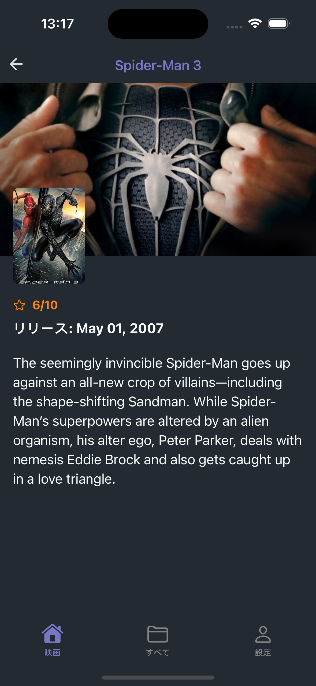
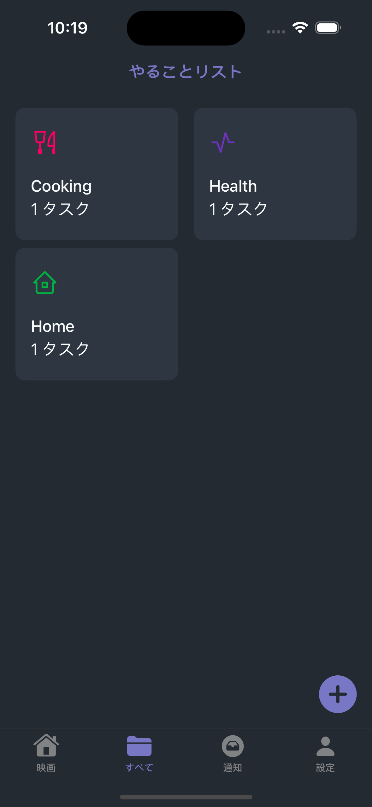
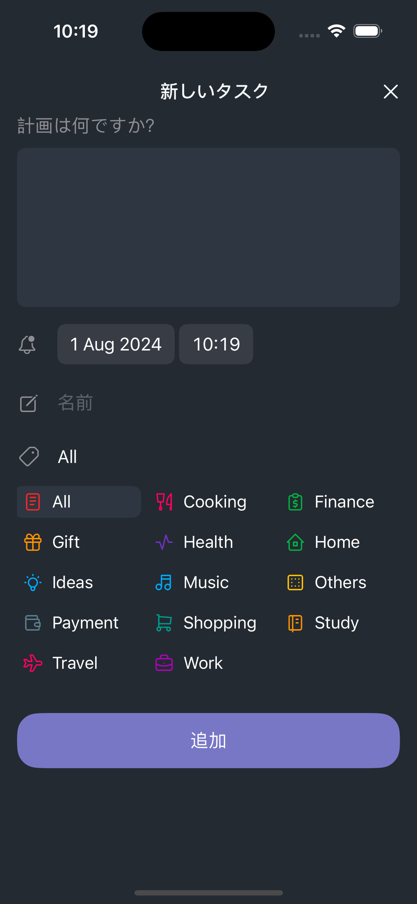
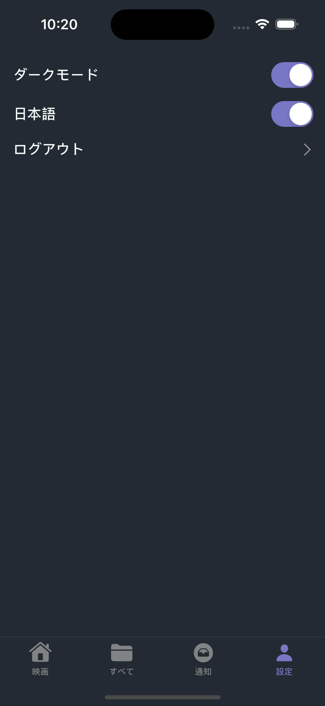

# TCA (The Composable Architecture) Example App

<p align="center">
  
  
  
  
  
  
  
  
</p>

This example app demonstrates the usage of TCA (The Composable Architecture) to build a SwiftUI application.

## Features
- **TCA**: Utilizes The Composable Architecture for managing state and side effects.
- **SwiftUI**: Declarative UI framework for building modern iOS apps.
- **Dependency Injection**: Easy management of dependencies and testability.
- **Unit Tests**: Includes unit tests for business logic and use cases.
- **Dark Mode**: Supports Dark Mode seamlessly.

## Requirements

- Xcode 15.0+
- Swift 5.3+
- [Homebrew](https://brew.sh/) installed 

## Installation

1. **Install Homebrew Dependencies**:

    ```bash
    brew install xcodegen swiftlint swiftformat
    ```

2. **Clone the Repository**:

    ```bash
    git clone git@github.com:ngocpd-1250/TCA-The-Composable-Architecture-example.git
    cd TCA_Example
    ```

3. **Generate Xcode Project**:

    Use `xcodegen` to generate the Xcode project:

    ```bash
    xcodegen
    ```

4. **Open Xcode**:

    Open the generated Xcode project:

    ```bash
    open TCA_Example.xcodeproj
    ```

5. **Build and Run**:

    Build and run the project in Xcode.
    
## Project Structure

The project is structured into the following directories:

- **Config**: Contains configuration files and settings.
- **DI**: Manages Dependency Injection configurations.
- **Data**: Handles data sources, repositories, and networking.
- **Presentation**: Contains SwiftUI views, TCA features, and navigators.
- **Resources**: Includes assets, localization files, and other resources.
- **Utils**: Houses shared utilities, extensions, and helper functions.


## Linting (optional)

1. **Linting**: [SwiftLint](https://github.com/realm/SwiftLint)
2. **Formatting**: [SwiftFormat](https://github.com/nicklockwood/SwiftFormat)

## Packages

1. [FlowStacks](https://github.com/johnpatrickmorgan/FlowStacks): for navigation management
2. [Factory](https://github.com/hmlongco/Factory.git): for dependency injection
3. [Rswift](https://github.com/mac-cain13/R.swift.git): for resource management
4. [Kingfisher](https://github.com/onevcat/Kingfisher.git): for loading and caching remote images
5. [Alamofire](https://github.com/Alamofire/Alamofire.git): for API requests


